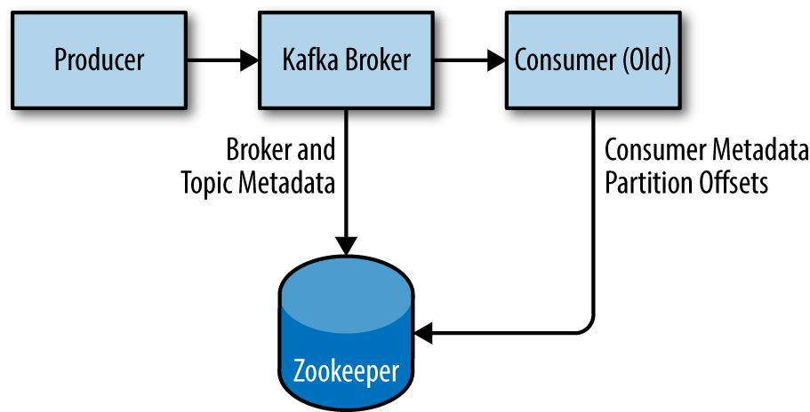

https://learning.oreilly.com/library/view/kafka-the-definitive/9781491936153/ch02.html

This chapter describes how to get started with the Apache Kafka broker, including how to set up ***Apache Zookeeper, which is used by Kafka for storing metadata for the brokers.***
we cover how to install multiple Kafka brokers as part of a single cluster and some specific concerns when using Kafka in a production environment.

### First Things First
There are a few things that need to happen before using Apache Kafka. The following sections tell you what those things are.

Choosing an Operating System 

Installing Java 

------------------------------------------------------------------------------------------------------------------------

#### Installing Zookeeper 
Apache Kafka uses Zookeeper to store metadata about the Kafka cluster, as well as consumer client details.

### ZOOKEEPER ENSEMBLE
A Zookeeper cluster is called an ensemble. ***Due to the algorithm used, it is recommended that ensembles contain an odd number of servers (e.g., 3, 5, etc.) as a majority of ensemble members (a quorum) must be working in order for Zookeeper to respond to requests***. This means that in a three-node ensemble, you can run with one node missing. With a five-node ensemble, you can run with two nodes missing.

### SIZING YOUR ZOOKEEPER ENSEMBLE
Consider running Zookeeper in a five-node ensemble. In order to make configuration changes to the ensemble, including swapping a node, you will need to reload nodes one at a time. If your ensemble cannot tolerate more than one node being down, doing maintenance work introduces additional risk. ***It is also not recommended to run more than seven nodes, as performance can start to degrade due to the nature of the consensus protocol.***

To configure Zookeeper servers in an ensemble, they must have a common configuration that lists all servers, and each server needs a myid file in the data directory that specifies the ID number of the server. If the hostnames of the servers in the ensemble are zoo1.example.com, zoo2.example.com, and zoo3.example.com, the configuration file might look like this:

`
tickTime=2000
dataDir=/var/lib/zookeeper
clientPort=2181
initLimit=20
syncLimit=5
server.1=zoo1.example.com:2888:3888
server.2=zoo2.example.com:2888:3888
server.3=zoo3.example.com:2888:3888
`

In this configuration, the initLimit is the amount of time to allow followers to connect with a leader. The syncLimit value limits how out-of-sync followers can be with the leader. Both values are a number of tickTime units, which makes the initLimit 20 * 2000 ms, or 40 seconds. The configuration also lists each server in the ensemble. 
The servers are specified in the format server.X=hostname:peerPort:leaderPort, with the following parameters:

X \
The ID number of the server. This must be an integer, but it does not need to be zero-based or sequential.

hostname \
The hostname or IP address of the server.

#### peerPort 
***The TCP port over which servers in the ensemble communicate with each other.***

#### leaderPort 
***The TCP port over which leader election is performed.***

***Clients only need to be able to connect to the ensemble over the clientPort, but the members of the ensemble must be able to communicate with each other over all three ports.***

In addition to the shared configuration file, each server must have a file in the dataDir directory with the name myid. This file must contain the ID number of the server, which must match the configuration file. Once these steps are complete, the servers will start up and communicate with each other in an ensemble.

-----------------------------------------------------------------------------------------------------------------------

### Installing a Kafka Broker

### Broker Configuration

There are numerous configuration options for Kafka that control all aspects of setup and tuning. Many options can be left to the default settings, as they deal with tuning aspects of the Kafka broker that will not be applicable until you have a specific use case to work with and a specific use case that requires adjusting these settings.

BROKER.ID \
PORT \
LOG.DIRS \
NUM.RECOVERY.THREADS.PER.DATA.DIR \
AUTO.CREATE.TOPICS.ENABLE \

#### Topic Defaults

***NUM.PARTITIONS *** 

***The num.partitions parameter determines how many partitions a new topic is created with, primarily when automatic topic creation is enabled (which is the default setting)***. This parameter defaults to one partition. ***Keep in mind that the number of partitions for a topic can only be increased, never decreased***. This means that if a topic needs to have fewer partitions than num.partitions, care will need to be taken to manually create the topic

partitions are the way a topic is scaled within a Kafka cluster, which makes it important to use partition counts that will balance the message load across the entire cluster as brokers are added. Many users will have the partition count for a topic be equal to, or a multiple of, the number of brokers in the cluster. This allows the partitions to be evenly distributed to the brokers, which will evenly distribute the message load. This is not a requirement, however, as you can also balance message load by having multiple topics.

--------------------------------------------------------------------------------------------------------------------------

### HOW TO CHOOSE THE NUMBER OF PARTITIONS
There are several factors to consider when choosing the number of partitions:

1) ***What is the throughput you expect to achieve for the topic?*** For example, do you expect to write 100 KB per second or 1 GB per second?

2) ***What is the maximum throughput you expect to achieve when consuming from a single partition? A partition will always be consumed completely by a single consumer*** (as even when not using consumer groups, the consumer must read all messages in the partition). ***If you know that your slower consumer writes the data to a database and this database never handles more than 50 MB per second from each thread writing to it, then you know you are limited to 50 MB/sec throughput when consuming from a partition.***

3) You can go through the same exercise to estimate the maximum throughput per producer for a single partition, ***but since producers are typically much faster than consumers, it is usually safe to skip this.***

4) If you are sending messages to partitions based on keys, adding partitions later can be very challenging, so calculate throughput based on your expected future usage, not the current usage.

5) Consider the number of partitions you will place on each broker and available diskspace and network bandwidth per broker.

6) ***Avoid overestimating, as each partition uses memory and other resources on the broker and will increase the time for leader elections.***

With all this in mind, it’s clear that you want many partitions but not too many. 

***If you have some estimate regarding the target throughput of the topic and the expected throughput of the consumers, you can divide the target throughput by the expected consumer throughput and derive the number of partitions this way***. 

So if I want to be able to write and read 1 GB/sec from a topic, and I know each consumer can only process 50 MB/s, then I know I need at least 20 partitions. This way, I can have 20 consumers reading from the topic and achieve 1 GB/sec.

If you don’t have this detailed information, our experience suggests that limiting the size of the partition on the disk to less than 6 GB per day of retention often gives satisfactory results.

-----------------------------------------------------------------------------------------------------------------------

### LOG.RETENTION.MS

***The most common configuration for how long Kafka will retain messages is by time***. 

The default is specified in the configuration file using the log.retention.hours parameter, and it is set to 168 hours, or one week. However, there are two other parameters allowed, log.retention.minutes and log.retention.ms. All three of these specify the same configuration—the amount of time after which messages may be deleted—but the recommended parameter to use is log.retention.ms, as the smaller unit size will take precedence if more than one is specified. This will make sure that the value set for log.retention.ms is always the one used. If more than one is specified, the smaller unit size will take precedence.

### RETENTION BY TIME AND LAST MODIFIED TIMES

***Retention by time is performed by examining the last modified time (mtime) on each log segment file on disk. Under normal cluster operations, this is the time that the log segment was closed, and represents the timestamp of the last message in the file***. 

However, when using administrative tools to move partitions between brokers, this time is not accurate and will result in excess retention for these partitions

### LOG.RETENTION.BYTES
***Another way to expire messages is based on the total number of bytes of messages retained. This value is set using the log.retention.bytes parameter, and it is applied per-partition***. This means that if you have a topic with 8 partitions, and log.retention.bytes is set to 1 GB, the amount of data retained for the topic will be 8 GB at most. Note that all retention is performed for individual partitions, not the topic. This means that should the number of partitions for a topic be expanded, the retention will also increase if log.retention.bytes is used.

### CONFIGURING RETENTION BY SIZE AND TIME
If you have specified a value for both log.retention.bytes and log.retention.ms (or another parameter for retention by time), messages may be removed when either criteria is met. For example, if log.retention.ms is set to 86400000 (1 day) and log.retention.bytes is set to 1000000000 (1 GB), it is possible for messages that are less than 1 day old to get deleted if the total volume of messages over the course of the day is greater than 1 GB. Conversely, if the volume is less than 1 GB, messages can be deleted after 1 day even if the total size of the partition is less than 1 GB.

--------------------------------------------------------------------------------------------------------------------------

### LOG.SEGMENT.BYTES
The log-retention settings previously mentioned operate on log segments, not individual messages. As messages are produced to the Kafka broker, they are appended to the current log segment for the partition. Once the log segment has reached the size specified by the log.segment.bytes parameter, which defaults to 1 GB, the log segment is closed and a new one is opened. Once a log segment has been closed, it can be considered for expiration. A smaller log-segment size means that files must be closed and allocated more often, which reduces the overall efficiency of disk writes.

Adjusting the size of the log segments can be important if topics have a low produce rate. For example, if a topic receives only 100 megabytes per day of messages, and log.segment.bytes is set to the default, it will take 10 days to fill one segment. As messages cannot be expired until the log segment is closed, if log.retention.ms is set to 604800000 (1 week), there will actually be up to 17 days of messages retained until the closed log segment expires. This is because once the log segment is closed with the current 10 days of messages, that log segment must be retained for 7 days before it expires based on the time policy (***as the segment cannot be removed until the last message in the segment can be expired***).

--------------------------------------------------------------------------------------------------------------------------

### RETRIEVING OFFSETS BY TIMESTAMP
The size of the log segment also affects the behavior of fetching offsets by timestamp. When requesting offsets for a partition at a specific timestamp, Kafka finds the log segment file that was being written at that time. It does this by using the creation and last modified time of the file, and looking for a file that was created before the timestamp specified and last modified after the timestamp. The offset at the beginning of that log segment (which is also the filename) is returned in the response.

 

