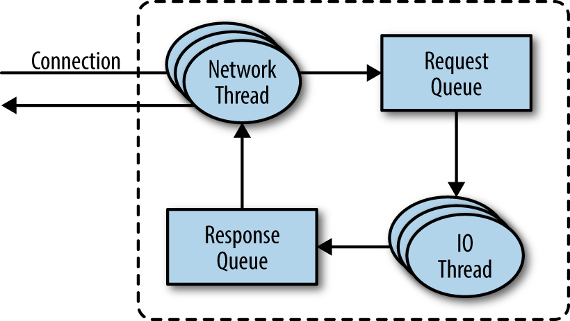
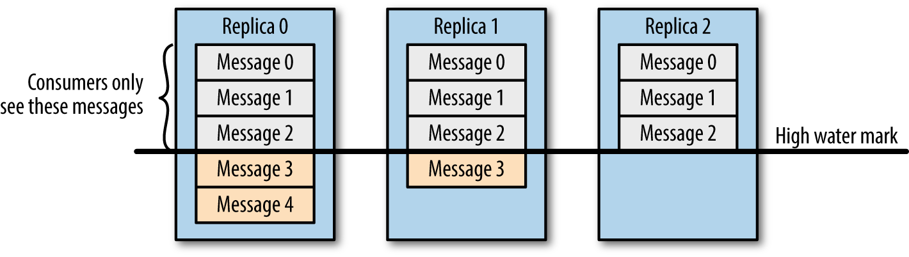
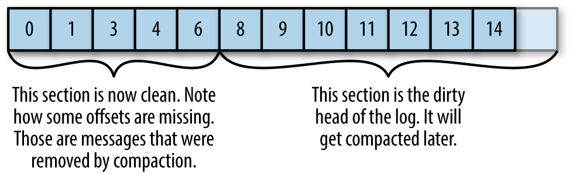

https://learning.oreilly.com/library/view/kafka-the-definitive/9781491936153/ch05.html

Since covering every single implementation detail and design decision is beyond the scope of this book, in this chapter we focus on three topics that are especially relevant to Kafka practitioners:

1) How Kafka replication works

2) How Kafka handles requests from producers and consumers

3) How Kafka handles storage such as file format and indexes

--------------------------------------------------------------------------------------------------------------------------------

### Cluster Membership
Kafka uses Apache Zookeeper to maintain the list of brokers that are currently members of a cluster. Every broker has a unique identifier that is either set in the broker configuration file or automatically generated. Every time a broker process starts, it registers itself with its ID in Zookeeper by creating an ephemeral node. Different Kafka components subscribe to the /brokers/ids path in Zookeeper where brokers are registered so that they get notified when brokers are added or removed.

If you try to start another broker with the same ID, you will get an error—the new broker will try to register, but fail because we already have a Zookeeper node for the same broker ID.

***When a broker loses connectivity to Zookeeper (usually as a result of the broker stopping, but this can also happen as a result of network partition or a long garbage-collection pause), the ephemeral node that the broker created when starting will be automatically removed from Zookeeper. Kafka components that are watching the list of brokers will be notified that the broker is gone.***

Even though the node representing the broker is gone when the broker is stopped, the broker ID still exists in other data structures. For example, the list of replicas of each topic (see “Replication”) contains the broker IDs for the replica. This way, if you completely lose a broker and start a brand new broker with the ID of the old one, it will immediately join the cluster in place of the missing broker with the same partitions and topics assigned to it.

-----------------------------------------------------------------------------------------------------------------------

### The Controller
***The controller is one of the Kafka brokers that, in addition to the usual broker functionality, is responsible for electing partition leaders (we’ll discuss partition leaders and what they do in the next section)***. The first broker that starts in the cluster becomes the controller by creating an ephemeral node in ZooKeeper called /controller. When other brokers start, they also try to create this node, but receive a “node already exists” exception, which causes them to “realize” that the controller node already exists and that the cluster already has a controller. The brokers create a Zookeeper watch on the controller node so they get notified of changes to this node. This way, we guarantee that the cluster will only have one controller at a time.

***When the controller broker is stopped or loses connectivity to Zookeeper, the ephemeral node will disappear. Other brokers in the cluster will be notified through the Zookeeper watch that the controller is gone and will attempt to create the controller node in Zookeeper themselves. The first node to create the new controller in Zookeeper is the new controller, while the other nodes will receive a “node already exists” exception and re-create the watch on the new controller node. Each time a controller is elected, it receives a new, higher controller epoch number through a Zookeeper conditional increment operation. The brokers know the current controller epoch and if they receive a message from a controller with an older number, they know to ignore it.***

***When the controller notices that a broker left the cluster (by watching the relevant Zookeeper path), it knows that all the partitions that had a leader on that broker will need a new leader. It goes over all the partitions that need a new leader, determines who the new leader should be (simply the next replica in the replica list of that partition), and sends a request to all the brokers that contain either the new leaders or the existing followers for those partitions. The request contains information on the new leader and the followers for the partitions. Each new leader knows that it needs to start serving producer and consumer requests from clients while the followers know that they need to start replicating messages from the new leader.***

When the controller notices that a broker joined the cluster, it uses the broker ID to check if there are replicas that exist on this broker. If there are, the controller notifies both new and existing brokers of the change, and the replicas on the new broker start replicating messages from the existing leaders.

***To summarize, Kafka uses Zookeeper’s ephemeral node feature to elect a controller and to notify the controller when nodes join and leave the cluster. The controller is responsible for electing leaders among the partitions and replicas whenever it notices nodes join and leave the cluster. The controller uses the epoch number to prevent a “split brain” scenario where two nodes believe each is the current controller.***

--------------------------------------------------------------------------------------------------------------------------

### Replication

Replication is at the heart of Kafka’s architecture. The very first sentence in Kafka’s documentation describes it as “a distributed, partitioned, replicated commit log service.” ***Replication is critical because it is the way Kafka guarantees availability and durability when individual nodes inevitably fail.***

As we’ve already discussed, data in Kafka is organized by topics. Each topic is partitioned, and each partition can have multiple replicas. Those replicas are stored on brokers, and each broker typically stores hundreds or even thousands of replicas belonging to different topics and partitions.

***There are two types of replicas:***

1) ***Leader replica***
Each partition has a single replica designated as the leader. All produce and consume requests go through the leader, in order to guarantee consistency.

2) ***Follower replica***
All replicas for a partition that are not leaders are called followers. Followers don’t serve client requests; their only job is to replicate messages from the leader and stay up-to-date with the most recent messages the leader has. In the event that a leader replica for a partition crashes, one of the follower replicas will be promoted to become the new leader for the partition.

Another task the leader is responsible for is knowing which of the follower replicas is up-to-date with the leader. Followers attempt to stay up-to-date by replicating all the messages from the leader as the messages arrive, but they can fail to stay in sync for various reasons, such as when network congestion slows down replication or when a broker crashes and all replicas on that broker start falling behind until we start the broker and they can start replicating again.

***In order to stay in sync with the leader, the replicas send the leader Fetch requests, the exact same type of requests that consumers send in order to consume messages. In response to those requests, the leader sends the messages to the replicas. Those Fetch requests contain the offset of the message that the replica wants to receive next, and will always be in order.***

A replica will request message 1, then message 2, and then message 3, and it will not request message 4 before it gets all the previous messages. This means that the leader can know that a replica got all messages up to message 3 when the replica requests message 4. By looking at the last offset requested by each replica, the leader can tell how far behind each replica is. If a replica hasn’t requested a message in more than 10 seconds or if it has requested messages but hasn’t caught up to the most recent message in more than 10 seconds, the replica is considered out of sync. If a replica fails to keep up with the leader, it can no longer become the new leader in the event of failure—after all, it does not contain all the messages.

The inverse of this, replicas that are consistently asking for the latest messages, is called in-sync replicas. Only in-sync replicas are eligible to be elected as partition leaders in case the existing leader fails.

The amount of time a follower can be inactive or behind before it is considered out of sync is controlled by the replica.lag.time.max.ms configuration parameter. This allowed lag has implications on client behavior and data retention during leader election.

In addition to the current leader, each partition has a preferred leader—the replica that was the leader when the topic was originally created. It is preferred because when partitions are first created, the leaders are balanced between brokers (we explain the algorithm for distributing replicas and leaders among brokers later in the chapter). As a result, we expect that when the preferred leader is indeed the leader for all partitions in the cluster, load will be evenly balanced between brokers. By default, Kafka is configured with auto.leader.rebalance.enable=true, which will check if the preferred leader replica is not the current leader but is in-sync and trigger leader election to make the preferred leader the current leader.

---------------------------------------------------------------------------------------------------------------------------

### Request Processing

***Most of what a Kafka broker does is process requests sent to the partition leaders from clients, partition replicas, and the controller. Kafka has a binary protocol (over TCP) that specifies the format of the requests and how brokers respond to them***—both when the request is processed successfully or when the broker encounters errors while processing the request. Clients always initiate connections and send requests, and the broker processes the requests and responds to them. All requests sent to the broker from a specific client will be processed in the order in which they were received—this guarantee is what allows Kafka to behave as a message queue and provide ordering guarantees on the messages it stores.

##### All requests have a standard header that includes:

1) Request type (also called API key)

2) Request version (so the brokers can handle clients of different versions and respond accordingly)

3) Correlation ID: a number that uniquely identifies the request and also appears in the response and in the error logs (the ID is used for troubleshooting)

4) Client ID: used to identify the application that sent the request

***For each port the broker listens on, the broker runs an acceptor thread that creates a connection and hands it over to a processor thread for handling. The number of processor threads (also called network threads) is configurable. The network threads are responsible for taking requests from client connections, placing them in a request queue, and picking up responses from a response queue and sending them back to clients.***

***Once requests are placed on the request queue, IO threads (also called request handler threads) are responsible for picking them up and processing them. The most common types of requests are:

1) Produce requests
Sent by producers and contain messages the clients write to Kafka brokers.

2) Fetch requests
Sent by consumers and follower replicas when they read messages from Kafka brokers

Both produce requests and fetch requests have to be sent to the leader replica of a partition. If a broker receives a produce request for a specific partition and the leader for this partition is on a different broker, the client that sent the produce request will get an error response of “Not a Leader for Partition.” The same error will occur if a fetch request for a specific partition arrives at a broker that does not have the leader for that partition. Kafka’s clients are responsible for sending produce and fetch requests to the broker that contains the leader for the relevant partition for the request.

***How do the clients know where to send the requests? Kafka clients use another request type called a metadata request, which includes a list of topics the client is interested in. The server response specifies which partitions exist in the topics, the replicas for each partition, and which replica is the leader. Metadata requests can be sent to any broker because all brokers have a metadata cache that contains this information.***

Clients typically cache this information and use it to direct produce and fetch requests to the correct broker for each partition. They also need to occasionally refresh this information (refresh intervals are controlled by the metadata.max.age.ms configuration parameter) by sending another metadata request so they know if the topic metadata changed—for example, if a new broker was added or some replicas were moved to a new broker (Figure 5-2). In addition, if a client receives the “Not a Leader” error to one of its requests, it will refresh its metadata before trying to send the request again, since the error indicates that the client is using outdated information and is sending requests to the wrong broker.

------------------------------------------------------------------------------------------------------------------------

### Produce Requests
As we saw in Chapter 3, ***a configuration parameter called acks is the number of brokers who need to acknowledge receiving the message before it is considered a successful write***. Producers can be configured to consider messages as “written successfully” when the message was accepted by just the leader (acks=1), all in-sync replicas (acks=all), or the moment the message was sent without waiting for the broker to accept it at all (acks=0).

When the broker that contains the lead replica for a partition receives a produce request for this partition, it will start by running a few validations:

1) Does the user sending the data have write privileges on the topic?

2) Is the number of acks specified in the request valid (only 0, 1, and “all” are allowed)?

3) If acks is set to all, are there enough in-sync replicas for safely writing the message? (Brokers can be configured to refuse new messages if the number of in-sync replicas falls below a configurable number; we will discuss this in more detail in Chapter 6, when we discuss Kafka’s durability and reliability guarantees.)

***Then it will write the new messages to local disk. On Linux, the messages are written to the filesystem cache and there is no guarantee about when they will be written to disk. Kafka does not wait for the data to get persisted to disk—it relies on replication for message durability.***

***Once the message is written to the leader of the partition, the broker examines the acks configuration—if acks is set to 0 or 1, the broker will respond immediately; if acks is set to all, the request will be stored in a buffer called purgatory until the leader observes that the follower replicas replicated the message, at which point a response is sent to the client.***

-----------------------------------------------------------------------------------------------------------------------------

### Fetch Requests
Brokers process fetch requests in a way that is very similar to the way produce requests are handled. ***The client sends a request, asking the broker to send messages from a list of topics, partitions, and offsets—something like “Please send me messages starting at offset 53 in partition 0 of topic Test and messages starting at offset 64 in partition 3 of topic Test.” Clients also specify a limit to how much data the broker can return for each partition***. The limit is important because clients need to allocate memory that will hold the response sent back from the broker. Without this limit, brokers could send back replies large enough to cause clients to run out of memory.

As we’ve discussed earlier, the request has to arrive to the leaders of the partitions specified in the request and the client will make the necessary metadata requests to make sure it is routing the fetch requests correctly. When the leader receives the request, it first checks if the request is valid—does this offset even exist for this particular partition? If the client is asking for a message that is so old that it got deleted from the partition or an offset that does not exist yet, the broker will respond with an error.

If the offset exists, the broker will read messages from the partition, up to the limit set by the client in the request, and send the messages to the client. ***Kafka famously uses a zero-copy method to send the messages to the clients—this means that Kafka sends messages from the file (or more likely, the Linux filesystem cache) directly to the network channel without any intermediate buffers. This is different than most databases where data is stored in a local cache before being sent to clients. This technique removes the overhead of copying bytes and managing buffers in memory, and results in much improved performance.***

In addition to setting an upper boundary on the amount of data the broker can return, clients can also set a lower boundary on the amount of data returned. Setting the lower boundary to 10K, for example, is the client’s way of telling the broker “Only return results once you have at least 10K bytes to send me.” This is a great way to reduce CPU and network utilization when clients are reading from topics that are not seeing much traffic. Instead of the clients sending requests to the brokers every few milliseconds asking for data and getting very few or no messages in return, the clients send a request, the broker waits until there is a decent amount of data and returns the data, and only then will the client ask for more (Figure 5-3). The same amount of data is read overall but with much less back and forth and therefore less overhead.

Of course, we wouldn’t want clients to wait forever for the broker to have enough data. After a while, it makes sense to just take the data that exists and process that instead of waiting for more. Therefore, clients can also define a timeout to tell the broker “If you didn’t satisfy the minimum amount of data to send within x milliseconds, just send what you got.”

***It is also interesting to note that not all the data that exists on the leader of the partition is available for clients to read. Most clients can only read messages that were written to all in-sync replicas (follower replicas, even though they are consumers, are exempt from this—otherwise replication would not work)***. We already discussed that the leader of the partition knows which messages were replicated to which replica, and until a message was written to all in-sync replicas, it will not be sent to consumers—attempts to fetch those messages will result in an empty response rather than an error.

------------------------------------------------------------------------------------------------------------------------------

------------------------------------------------------------------------------------------------------------------------------

***The reason for this behavior is that messages not replicated to enough replicas yet are considered “unsafe”—if the leader crashes and another replica takes its place, these messages will no longer exist in Kafka. If we allowed clients to read messages that only exist on the leader, we could see inconsistent behavior. For example, if a consumer reads a message and the leader crashed and no other broker contained this message, the message is gone. No other consumer will be able to read this message, which can cause inconsistency with the consumer who did read it. Instead, we wait until all the in-sync replicas get the message and only then allow consumers to read it (Figure 5-4). This behavior also means that if replication between brokers is slow for some reason, it will take longer for new messages to arrive to consumers (since we wait for the messages to replicate first). This delay is limited to replica.lag.time.max.ms—the amount of time a replica can be delayed in replicating new messages while still being considered in-sync.***

------------------------------------------------------------------------------------------------------------------------

### Other Requests

We just discussed the most common types of requests used by Kafka clients: Metadata, Produce, and Fetch. It is important to remember that we are talking about a generic binary protocol used by clients over the network.

***In addition, the same protocol is used to communicate between the Kafka brokers themselves***. Those requests are internal and should not be used by clients. For example, when the controller announces that a partition has a new leader, it sends a LeaderAndIsr request to the new leader (so it will know to start accepting client requests) and to the followers (so they will know to follow the new leader).

The Kafka protocol currently handles 20 different request types, and more will be added. The protocol is ever-evolving—as we add more client capabilities, we need to grow the protocol to match. For example, in the past, Kafka Consumers used Apache Zookeeper to keep track of the offsets they receive from Kafka. So when a consumer is started, it can check Zookeeper for the last offset that was read from its partitions and know where to start processing. For various reasons, we decided to stop using Zookeeper for this, and instead store those offsets in a special Kafka topic. In order to do this, we had to add several requests to the protocol: OffsetCommitRequest, OffsetFetchRequest, and ListOffsetsRequest. Now when an application calls the client API to commit consumer offsets, the client no longer writes to Zookeeper; instead, it sends OffsetCommitRequest to Kafka.

Topic creation is still done by command-line tools that update the list of topics in Zookeeper directly, and brokers watch the topic list in Zookeeper to know when new topics are added. We are working on improving Kafka and adding a CreateTopicRequest that will allow all clients (even in languages that don’t have a Zookeeper library) to create topics by asking Kafka brokers directly.

In addition to evolving the protocol by adding new request types, we sometimes choose to modify existing requests to add some capabilities. For example, between Kafka 0.9.0 and Kafka 0.10.0, we decided to let clients know who the current controller is by adding the information to the Metadata response. As a result, we added a new version to the Metadata request and response. Now, 0.9.0 clients send Metadata requests of version 0 (because version 1 did not exist in 0.9.0 clients) and the brokers, whether they are 0.9.0 or 0.10.0 know to respond with a version 0 response, which does not have the controller information. This is fine, because 0.9.0 clients don’t expect the controller information and wouldn’t know how to parse it anyway. If you have the 0.10.0 client, it will send a version 1 Metadata request and 0.10.0 brokers will respond with a version 1 response that contains the controller information, which the 0.10.0 clients can use. If a 0.10.0 client sends a version 1 Metadata request to a 0.9.0 broker, the broker will not know how to handle the newer version of the request and will respond with an error. This is the reason we recommend upgrading the brokers before upgrading any of the clients—new brokers know how to handle old requests, but not vice versa.

In release 0.10.0 we added ApiVersionRequest, which allows clients to ask the broker which versions of each request is supported and to use the correct version accordingly. Clients that use this new capability correctly will be able to talk to older brokers by using a version of the protocol that is supported by the broker they are connecting to.

--------------------------------------------------------------------------------------------------------------------

### Physical Storage
The basic storage unit of Kafka is a partition replica. Partitions cannot be split between multiple brokers and not even between multiple disks on the same broker. So the size of a partition is limited by the space available on a single mount point. (A mount point will consist of either a single disk, if JBOD configuration is used, or multiple disks, if RAID is configured. See Chapter 2.)

When configuring Kafka, the administrator defines a list of directories in which the partitions will be stored—this is the log.dirs parameter (not to be confused with the location in which Kafka stores its error log, which is configured in the log4j.properties file). The usual configuration includes a directory for each mount point that Kafka will use.

Let’s look at how Kafka uses the available directories to store data. First, we want to look at how data is allocated to the brokers in the cluster and the directories in the broker. Then we will look at how the broker manages the files—especially how the retention guarantees are handled. We will then dive inside the files and look at the file and index formats. Lastly we will look at Log Compaction, an advanced feature that allows turning Kafka into a long-term data store, and describe how it works.

### Partition Allocation
When you create a topic, Kafka first decides how to allocate the partitions between brokers. Suppose you have 6 brokers and you decide to create a topic with 10 partitions and a replication factor of 3. Kafka now has 30 partition replicas to allocate to 6 brokers. When doing the allocations, the goals are:

1) To spread replicas evenly among brokers—in our example, to make sure we allocate 5 replicas per broker.

2) To make sure that for each partition, each replica is on a different broker. If partition 0 has the leader on broker 2, we can place the followers on brokers 3 and 4, but not on 2 and not both on 3.

3) If the brokers have rack information (available in Kafka release 0.10.0 and higher), then assign the replicas for each partition to different racks if possible. This ensures that an event that causes downtime for an entire rack does not cause complete unavailability for partitions.

To do this, we start with a random broker (let’s say, 4) and start assigning partitions to each broker in round-robin manner to determine the location for the leaders. So partition leader 0 will be on broker 4, partition 1 leader will be on broker 5, partition 2 will be on broker 0 (because we only have 6 brokers), and so on. Then, for each partition, we place the replicas at increasing offsets from the leader. If the leader for partition 0 is on broker 4, the first follower will be on broker 5 and the second on broker 0. The leader for partition 1 is on broker 5, so the first replica is on broker 0 and the second on broker 1.

When rack awareness is taken into account, instead of picking brokers in numerical order, we prepare a rack-alternating broker list. Suppose that we know that brokers 0, 1, and 2 are on the same rack, and brokers 3, 4, and 5 are on a separate rack. Instead of picking brokers in the order of 0 to 5, we order them as 0, 3, 1, 4, 2, 5—each broker is followed by a broker from a different rack (Figure 5-5). In this case, if the leader for partition 0 is on broker 4, the first replica will be on broker 2, which is on a completely different rack. This is great, because if the first rack goes offline, we know that we still have a surviving replica and therefore the partition is still available. This will be true for all our replicas, so we have guaranteed availability in the case of rack failure.

Once we choose the correct brokers for each partition and replica, it is time to decide which directory to use for the new partitions. We do this independently for each partition, and the rule is very simple: we count the number of partitions on each directory and add the new partition to the directory with the fewest partitions. This means that if you add a new disk, all the new partitions will be created on that disk. This is because, until things balance out, the new disk will always have the fewest partitions.

##### MIND THE DISK SPACE
Note that the allocation of partitions to brokers does not take available space or existing load into account, and that allocation of partitions to disks takes the number of partitions into account, but not the size of the partitions. This means that if some brokers have more disk space than others (perhaps because the cluster is a mix of older and newer servers), some partitions are abnormally large, or you have disks of different sizes on the same broker, you need to be careful with the partition allocation.

---------------------------------------------------------------------------------------------------------------------

### File Management
Retention is an important concept in Kafka—Kafka does not keep data forever, nor does it wait for all consumers to read a message before deleting it. Instead, the Kafka administrator configures a retention period for each topic—either the amount of time to store messages before deleting them or how much data to store before older messages are purged.

***Because finding the messages that need purging in a large file and then deleting a portion of the file is both time-consuming and error-prone, we instead split each partition into segments. By default, each segment contains either 1 GB of data or a week of data, whichever is smaller. As a Kafka broker is writing to a partition, if the segment limit is reached, we close the file and start a new one.***

The segment we are currently writing to is called an active segment. The active segment is never deleted, so if you set log retention to only store a day of data but each segment contains five days of data, you will really keep data for five days because we can’t delete the data before the segment is closed. If you choose to store data for a week and roll a new segment every day, you will see that every day we will roll a new segment while deleting the oldest segment—so most of the time the partition will have seven segments.

As you learned in Chapter 2, ***a Kafka broker will keep an open file handle to every segment in every partition—even inactive segments. This leads to an usually high number of open file handles, and the OS must be tuned accordingly.***

### File Format

***Each segment is stored in a single data file. Inside the file, we store Kafka messages and their offsets. The format of the data on the disk is identical to the format of the messages that we send from the producer to the broker and later from the broker to the consumers. Using the same message format on disk and over the wire is what allows Kafka to use zero-copy optimization when sending messages to consumers and also avoid decompressing and recompressing messages that the producer already compressed.***

Each message contains—in addition to its key, value, and offset—things like the message size, checksum code that allows us to detect corruption, magic byte that indicates the version of the message format, compression codec (Snappy, GZip, or LZ4), and a timestamp (added in release 0.10.0). The timestamp is given either by the producer when the message was sent or by the broker when the message arrived—depending on configuration.

If the producer is sending compressed messages, all the messages in a single producer batch are compressed together and sent as the “value” of a “wrapper message” (Figure 5-6). So the broker receives a single message, which it sends to the consumer. But when the consumer decompresses the message value, it will see all the messages that were contained in the batch, with their own timestamps and offsets.

???? Read this section again from the book

----------------------------------------------------------------------------------------------------------------

### Indexes
Kafka allows consumers to start fetching messages from any available offset. This means that if a consumer asks for 1 MB messages starting at offset 100, the broker must be able to quickly locate the message for offset 100 (which can be in any of the segments for the partition) and start reading the messages from that offset on. ***In order to help brokers quickly locate the message for a given offset, Kafka maintains an index for each partition. The index maps offsets to segment files and positions within the file.***

***Indexes are also broken into segments, so we can delete old index entries when the messages are purged***. Kafka does not attempt to maintain checksums of the index. If the index becomes corrupted, it will get regenerated from the matching log segment simply by rereading the messages and recording the offsets and locations. It is also completely safe for an administrator to delete index segments if needed—they will be regenerated automatically.

----------------------------------------------------------------------------------------------------------------

### Compaction
Normally, Kafka will store messages for a set amount of time and purge messages older than the retention period. However, imagine a case where you use Kafka to store shipping addresses for your customers. In that case, it makes more sense to store the last address for each customer rather than data for just the last week or year. This way, you don’t have to worry about old addresses and you still retain the address for customers who haven’t moved in a while. ***Another use case can be an application that uses Kafka to store its current state. Every time the state changes, the application writes the new state into Kafka. When recovering from a crash, the application reads those messages from Kafka to recover its latest state. In this case, it only cares about the latest state before the crash, not all the changes that occurred while it was running.***

Kafka supports such use cases by allowing the retention policy on a topic to be delete, which deletes events older than retention time, to compact, which only stores the most recent value for each key in the topic. Obviously, setting the policy to compact only makes sense on topics for which applications produce events that contain both a key and a value. If the topic contains null keys, compaction will fail.

***How Compaction Works***

Each log is viewed as split into two portions 

1) ***Clean
Messages that have been compacted before. This section contains only one value for each key, which is the latest value at the time of the previous compaction

2) ***Dirty
Messages that were written after the last compaction.

***If compaction is enabled when Kafka starts (using the awkwardly named log.cleaner.enabled configuration), each broker will start a compaction manager thread and a number of compaction threads. These are responsible for performing the compaction tasks. Each of these threads chooses the partition with the highest ratio of dirty messages to total partition size and cleans this partition.***

To compact a partition, the cleaner thread reads the dirty section of the partition and creates an in-memory map. Each map entry is comprised of a 16-byte hash of a message key and the 8-byte offset of the previous message that had this same key. This means each map entry only uses 24 bytes. If we look at a 1 GB segment and assume that each message in the segment takes up 1 KB, the segment will contain 1 million such messages and we will only need a 24 MB map to compact the segment (we may need a lot less—if the keys repeat themselves, we will reuse the same hash entries often and use less memory). This is quite efficient!

??? Read it again

---------------------------------------------------------------------------------------------------------------

### Deleted Events
If we always keep the latest message for each key, what do we do when we really want to delete all messages for a specific key, such as if a user left our service and we are legally obligated to remove all traces of that user from our system?

***In order to delete a key from the system completely, not even saving the last message, the application must produce a message that contains that key and a null value. When the cleaner thread finds such a message, it will first do a normal compaction and retain only the message with the null value. It will keep this special message (known as a tombstone) around for a configurable amount of time. During this time, consumers will be able to see this message and know that the value is deleted. So if a consumer copies data from Kafka to a relational database, it will see the tombstone message and know to delete the user from the database. After this set amount of time, the cleaner thread will remove the tombstone message, and the key will be gone from the partition in Kafka. It is important to give consumers enough time to see the tombstone message, because if our consumer was down for a few hours and missed the tombstone message, it will simply not see the key when consuming and therefore not know that it was deleted from Kafka or to delete it from the database.***

###### When Are Topics Compacted?
In the same way that the delete policy never deletes the current active segments, the compact policy never compacts the current segment. Messages are eligble for compaction only on inactive segments.

In version 0.10.0 and older, Kafka will start compacting when 50% of the topic contains dirty records. The goal is not to compact too often (since compaction can impact the read/write performance on a topic), but also not leave too many dirty records around (since they consume disk space). Wasting 50% of the disk space used by a topic on dirty records and then compacting them in one go seems like a reasonable trade-off, and it can be tuned by the administrator.

In future versions, we are planning to add a grace period during which we guarantee that messages will remain uncompacted. This will allow applications that need to see every message that was written to the topic enough time to be sure they indeed saw those messages even if they are lagging a bit.

